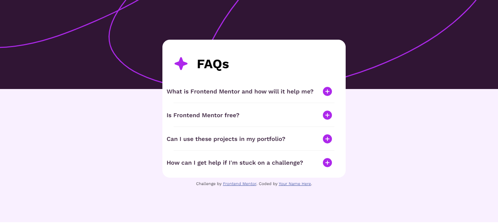
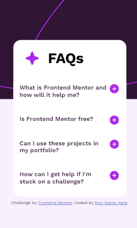

# Frontend Mentor - FAQ accordion solution

This is a solution to the [FAQ accordion challenge on Frontend Mentor](https://www.frontendmentor.io/challenges/faq-accordion-wyfFdeBwBz). Frontend Mentor challenges help you improve your coding skills by building realistic projects.

## Table of contents

-   [Overview](#overview)
    -   [The challenge](#the-challenge)
    -   [Screenshot](#screenshot)
    -   [Links](#links)
-   [My process](#my-process)
    -   [Built with](#built-with)
    -   [What I learned](#what-i-learned)
    -   [Continued development](#continued-development)
    -   [Useful resources](#useful-resources)
-   [Author](#author)
-   [Acknowledgments](#acknowledgments)

**Note: Delete this note and update the table of contents based on what sections you keep.**

## Overview

### The challenge

Users should be able to:

-   Hide/Show the answer to a question when the question is clicked
-   Navigate the questions and hide/show answers using keyboard navigation alone
-   View the optimal layout for the interface depending on their device's screen size
-   See hover and focus states for all interactive elements on the page

### Screenshot




### Links

-   Solution URL: [Add solution URL here](https://your-solution-url.com)
-   Live Site URL: [Add live site URL here](https://your-live-site-url.com)

## My process

### Built with

-   Semantic HTML5 markup
-   CSS custom properties
-   Flexbox
-   [Google Fonts](https://fonts.google.com/?query=work+sans) -

### What I learned

I learnt a lot more about CSS layouts using parent and child div elements

```html
<div class="container">
    <div class="faq-container-banner">
        <div class="faq-container">
            <div class="faq-heading"></div>
        </div>
    </div>
</div>
```

```css
.faq {
    background-color: transparent;
    border: 1px solid var(--white-color);
    border-radius: 10px;
    margin: 10px 0;
    padding: 10px;
    position: relative;
    overflow: hidden;
    transition: 0.3s ease;
}
```

If you want more help with writing markdown, we'd recommend checking out [The Markdown Guide](https://www.markdownguide.org/) to learn more.

**Note: Delete this note and the content within this section and replace with your own learnings.**

### Continued development

Use this section to outline areas that you want to continue focusing on in future projects. These could be concepts you're still not completely comfortable with or techniques you found useful that you want to refine and perfect.

**Note: Delete this note and the content within this section and replace with your own plans for continued development.**

### Useful resources

-   [Learn Layouts](https://learnlayout.com/) - This helped me for in styling the div elements to get the layout and understanding media queries better.

## Author

-   Website - [Sope](https://ksopedev-site.netlify.app/)
-   Frontend Mentor - [@ksope](https://www.frontendmentor.io/profile/ksope)

## Acknowledgments

None for now 😃!
